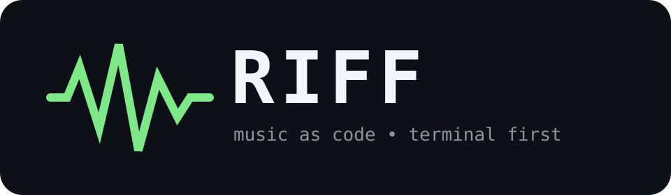

<div align="center">
  

  <p><strong>Music as code. Spotify in your terminal.</strong></p>
  <p>A terminal-first music player written in Rust, designed around declarative, versionable playlists.</p>

  <p>
    <a href="https://github.com/Nicolas25vlad/riff/actions/workflows/ci.yml?query=branch%3Amain"></a>
    
    
    
  </p>
</div>

---

## What is Riff?

Riff is an experiment in treating your music library the way developers treat infrastructure and configuration.

Instead of building every playlist by clicking through a GUI, you describe it in a small text format, keep it beside your dotfiles, review changes with `git diff`, share it on GitHub, and eventually let Riff resolve and play it through Spotify.

```riff
playlist "coding-metal" {
    track "Black Sabbath - War Pigs"
    track "Dio - Holy Diver"
    track "Metallica - Orion"
    track "Megadeth - Tornado of Souls"
}
```

```console
$ riff validate examples/coding-metal.riff
✓ coding-metal is valid (4 tracks)

$ riff inspect examples/coding-metal.riff
coding-metal
4 tracks

  1. Black Sabbath - War Pigs
  2. Dio - Holy Diver
  3. Metallica - Orion
  4. Megadeth - Tornado of Souls
```

The long-term goal is a complete terminal music experience powered by Rust, `librespot`, Ratatui and a declarative playlist engine.

## Why?

Spotify playlists are useful, but they are mostly opaque application state. Riff explores a different model:

- **Playlists as source code**: readable text files with deterministic ordering.
- **Git-native music libraries**: branch, diff, review, fork and share playlists like code.
- **Terminal-first playback**: search, queue, play, pause and navigate without leaving your shell.
- **Native Spotify playback**: use `librespot` so Riff can eventually act as its own Spotify Connect device.
- **Rich terminal UI**: album artwork, queue management, playback state and audio visualization.
- **Provider-independent core**: Spotify first, without making the playlist language permanently Spotify-specific.

## Vision

The end state should feel less like a thin Spotify wrapper and more like a tiny music operating environment for the terminal.

```text
┌──────────────────────────────────────────────────────────────┐
│ RIFF                                              03:21 / 07:57│
├──────────────────────┬───────────────────────────────────────┤
│                      │ Black Sabbath                         │
│    [ album art ]     │ War Pigs                              │
│                      │ Paranoid                              │
│                      │                                       │
│                      │ ▁▂▃▅▇▅▃▂▂▃▆██▆▄▃▂▁▂▅▇██▅▂           │
├──────────────────────┴───────────────────────────────────────┤
│ Queue                                                        │
│ > War Pigs                                                   │
│   Holy Diver                                                 │
│   Orion                                                       │
│   Tornado of Souls                                           │
├──────────────────────────────────────────────────────────────┤
│ j/k move   space pause   n next   / search   : command       │
└──────────────────────────────────────────────────────────────┘
```

The audio path is planned around decoded PCM from `librespot`, which lets playback and visualization share the same stream:

```text
.riff files
    │
    ▼
 parser / AST
    │
    ▼
 playlist engine ───────► provider resolution
                              │
                              ▼
                           librespot
                              │
                           decoded PCM
                           ╱         ╲
                          ▼           ▼
                    audio output   FFT/analyzer
                                      │
                                      ▼
                                  visualizer
```

## Current status

Riff is in **early development**. The repository currently contains the first intentionally small foundation:

- a dependency-free Rust CLI core;
- `riff doctor`;
- `riff validate <file>`;
- `riff inspect <file>`;
- the first parser for the `.riff` playlist format;
- parser tests;
- CI for formatting, Clippy, tests and `cargo check`.

There is no Spotify playback yet. The initial parser is deliberately tiny so the language can evolve from a clear grammar instead of accreting random syntax.

## Planned playlist language

The current implementation only supports explicit `track` statements. The eventual language is intended to become expressive enough to describe both static playlists and reproducible selection rules.

```riff
playlist "night-shift" {
    add artist("Black Sabbath").top(8)
    add album("Holy Diver", by="Dio")

    add artist("Megadeth")
        .take(5)
        .shuffle(seed=666)

    exclude live
    exclude acoustic
}
```

The important property is reproducibility. A seeded or otherwise deterministic playlist definition should resolve to the same ordering when possible.

Eventually, Riff should be able to show playlist changes before applying them:

```diff
coding-metal

+ Dio - Holy Diver
+ Black Sabbath - Supernaut
- Metallica - Fuel

Plan: 2 to add, 1 to remove, 4 to reorder
```

```console
$ riff apply
✓ coding-metal synchronized
```

Yes, the aspiration is essentially **Terraform for playlists**, with significantly more guitar riffs.

## CLI

Available today:

```text
riff doctor
riff validate <file>
riff inspect <file>
riff help
riff version
```

Planned commands include:

```text
riff play [playlist|track]
riff pause
riff next
riff previous
riff search <query>
riff queue add <query>
riff status
riff apply
riff tui
```

## Getting started

### Requirements

- Rust stable with Cargo
- Git

Clone and run:

```bash
git clone https://github.com/Nicolas25vlad/riff.git
cd riff
cargo run -- doctor
```

Try the example playlist:

```bash
cargo run -- validate examples/coding-metal.riff
cargo run -- inspect examples/coding-metal.riff
```

Run the quality suite:

```bash
cargo fmt --all -- --check
cargo clippy --all-targets --all-features -- -D warnings
cargo test --all-features
cargo check --all-targets --all-features
```

## Architecture

The project is intentionally still a single crate while its public concepts settle. Splitting into a workspace too early would freeze boundaries we have not earned yet.

The intended evolution is roughly:

```text
riff/
├── riff-cli          command-line interface
├── riff-core         playback state, queue and domain model
├── riff-lang         lexer, parser and playlist AST
├── riff-provider     provider abstraction
├── riff-spotify      Spotify/librespot integration
├── riff-audio        PCM pipeline and audio output
├── riff-visualizer   FFT, spectrum, waveform and meters
├── riff-image        terminal image protocols and fallbacks
└── riff-tui          Ratatui application
```

Likely technologies as the project grows:

| Area | Direction |
| --- | --- |
| Language | Rust |
| Spotify playback | librespot |
| Terminal UI | Ratatui + Crossterm |
| Async runtime | Tokio |
| Local state/cache | SQLite |
| Audio analysis | FFT over decoded PCM |
| Cover art | Kitty graphics / Sixel / Unicode fallback |
| Playlist language | custom parser + typed AST |

Nothing in that table should be considered a permanent dependency commitment yet. Riff should earn complexity one feature at a time.

## Roadmap

### v0.1 · Foundation

- [x] Project identity and documentation
- [x] Minimal CLI
- [x] First `.riff` parser
- [x] Playlist validation and inspection
- [x] Unit tests and CI
- [ ] Formalize the first grammar
- [ ] Better diagnostics with line/column information

### v0.2 · Spotify core

- [ ] Authentication/session management
- [ ] Track search and metadata resolution
- [ ] `librespot` playback
- [ ] Spotify Connect device mode
- [ ] Play, pause, seek, next and previous

### v0.3 · Terminal player

- [ ] Ratatui interface
- [ ] Queue browser
- [ ] Search view
- [ ] Album artwork
- [ ] Configurable keybindings

### v0.4 · Audio candy

- [ ] PCM analysis pipeline
- [ ] Spectrum visualizer
- [ ] Waveform / oscilloscope mode
- [ ] VU meter
- [ ] Theme extraction from album covers

### v0.5 · Music as code

- [ ] Expressions and reusable playlist fragments
- [ ] Deterministic shuffle seeds
- [ ] Filters and exclusions
- [ ] Imports
- [ ] Provider-independent track references
- [ ] `riff plan`
- [ ] `riff apply`

## Design principles

1. **Terminal first, not terminal only.** The CLI should remain scriptable even when the TUI becomes rich.
2. **Text files are the source of truth.** A playlist should be understandable without launching Riff.
3. **Determinism where possible.** Music definitions should be reproducible enough to meaningfully version.
4. **Fast startup matters.** A terminal player that feels heavy has missed the point.
5. **Keep provider concerns isolated.** The language should describe music, not leak Spotify internals everywhere.
6. **No architecture cosplay.** Crates, traits and abstractions appear when they solve real problems.

## Contributing

Riff is extremely young, which means design discussion is currently as valuable as code.

Before implementing a large subsystem, open an issue describing the proposed behavior and how it fits the project. Small fixes, tests and documentation improvements can go directly to a pull request.

Basic workflow:

```bash
git checkout -b feat/my-feature
cargo fmt
cargo clippy --all-targets --all-features -- -D warnings
cargo test
```

Please keep commits focused and prefer tests around parser behavior and state transitions.

## Name

A **riff** is a short musical phrase that gives a song identity. It also happens to be short, terminal-friendly, and looks suspiciously appropriate next to a Rust crab.

## Disclaimer

Riff is an independent open-source project and is not affiliated with, endorsed by, or sponsored by Spotify AB. Spotify is a trademark of Spotify AB.

Spotify-specific functionality planned for Riff may require Spotify Premium and will depend on the capabilities and compatibility of `librespot` and Spotify's services at the time of implementation.

## License

Riff is released under the [MIT License](LICENSE).

<div align="center">
  <strong>Write playlists. Commit them. Play them.</strong>
</div>
